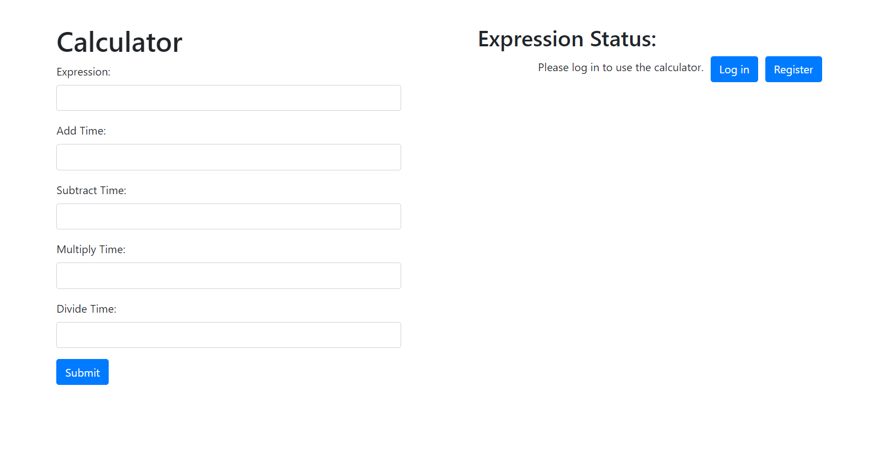
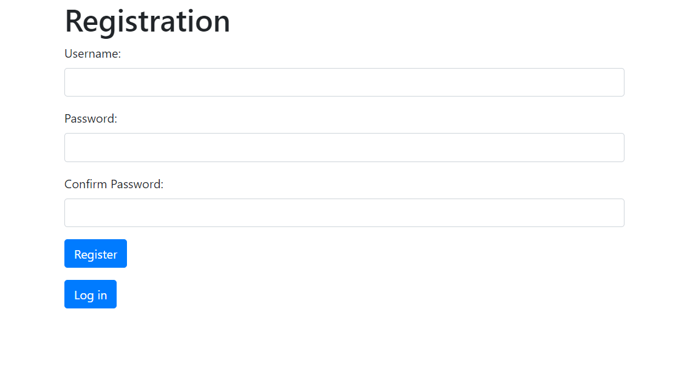
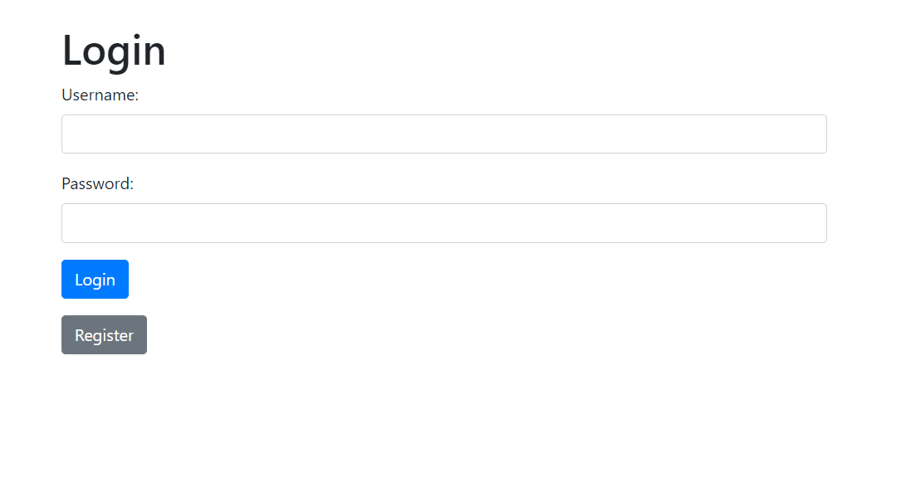
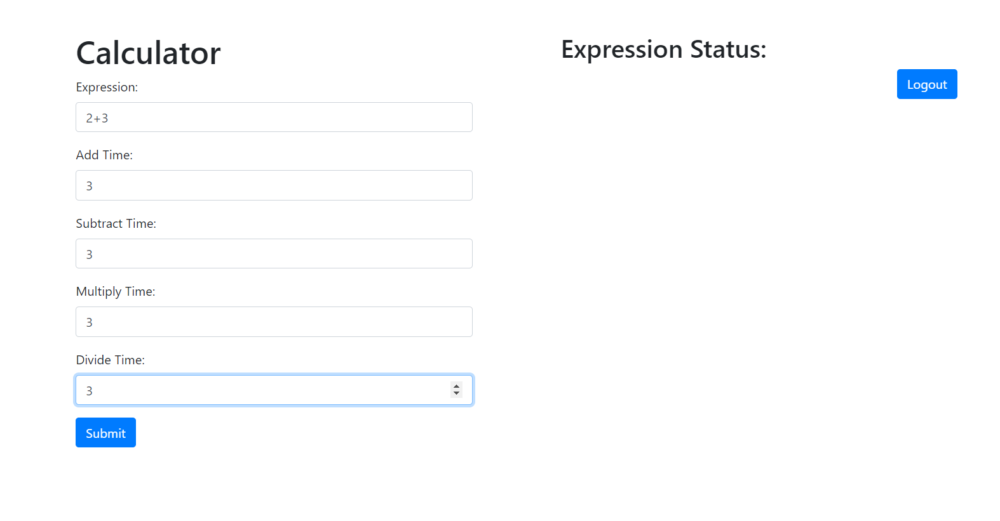
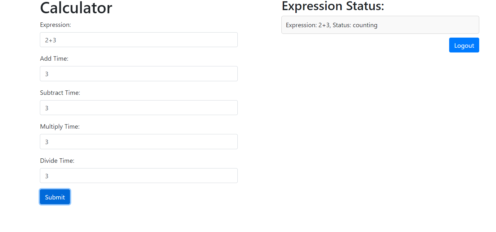

# Calculus

Финальный проект Яндекс Лицея

### В случае ошибки или при любых других вопросах пишите сюда [@Rakhimov_Ans](https://t.me/Rakhimov_Ans)

## Установка
___

#### Docker
Для начала на вашем компьютере должен быть установлен [Docker](https://docker.com). Как его установить написано в [документации](https://docs.docker.com/get-docker/).

#### Клонирование репозитория

Далее необходимо клонировать репозиторий с кодом

```bash
git clone https://github.com/RakhimovAns/FinalYandexTask.git
```

#### Build

После этого нужно создать билд с помощью Docker Compose

```bash
docker-compose build
```

P.S Этот процесс может занять довольно много времени, так, что заварите чашечку кофе ☕
___
## Запуск

После этого можно запускать проект

Для того чтобы запустить все сервисы:

```bash
docker-compose up 
```
___
### После запуска

#### Главная страница

После перехода на [`localhost:8080`](http://localhost:8080) открывается главная страница с полем для ввода и выражениями.



___
Для начала нужно зарегистрироваться **(если не войдете в аккаунт калькулятор не будет работать)**, нажав на кнопку Register. После он перейдет на страничку регистрации.



___

Далее войдите в аккаунт



____

После того как зашли, можете пользоваться калькулятором.

Пример заполнения:



Нажимаем на кнопку submit, и появится мониторинг выражении



____

## Итог
[пишите](https://moolcoov.t.me). Не судите строго, всем удачи.
____
by Rakhimov Ansar.